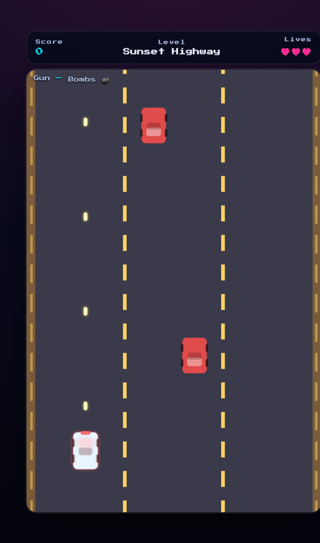

# BombJack 🚗💥

> A retro **vertical-scrolling road shooter** — blast down the highway through 10 themed levels, dodge hazards, grab power-ups, beat the bosses, and climb the online leaderboard.

[](https://danmat.github.io/BombJack/)
&nbsp;


<p align="center">
  
</p>

## Features

- 🎮 **Canvas game engine** — smooth 60fps, no jQuery, no dependencies. All art is drawn **procedurally** (no image assets).
- 🛣️ **10 themed levels** — Sunset Highway, Night City, Desert Run, Rush Hour, Tunnel, Coastal Bridge, Snowy Pass, Canyon, Neon Speedway and the Final Gauntlet, each ending in a **boss fight**.
- 👾 **Enemy variety** — cars, fast bikes, weaving cars, tanky trucks, and shooters that fire back.
- ⚡ **Power-ups** — spread / triple / rapid guns, shield, nitro-boost, extra life, and smart bombs.
- 🚧 **Road hazards** — dodge barriers, cones and slippery oil slicks on top of the enemies.
- 🔥 **Combo multiplier** — chain kills for up to 6× score.
- 🏆 **Online leaderboard** — enter your 3-letter initials; scores are shared across devices.
- 🕹️ **Play anywhere** — arrow keys / WASD, or drag on touch. Your gun auto-fires.

## Controls

| Action | Input |
| --- | --- |
| Steer | Arrow keys · WASD · touch drag |
| Fire | Automatic |
| Smart bomb | <kbd>Space</kbd> / <kbd>X</kbd> / 💣 button |
| Pause | <kbd>P</kbd> or <kbd>Esc</kbd> |

## Online leaderboard

BombJack shares one **Supabase** project (and `scores` table) with the other games,
namespaced by `gameId`. It works out of the box on **localStorage**; to enable
shared online scores:

1. Create a free project at [supabase.com](https://supabase.com) and run
   [`docs/supabase.sql`](docs/supabase.sql) in the SQL editor (once, shared by all games).
2. Put your **Project URL** and public **anon/publishable key** in
   [`js/config.js`](js/config.js) (already filled in for this repo):
   ```js
   window.GAME_CONFIG = {
     supabaseUrl: 'https://YOUR-PROJECT.supabase.co',
     supabaseAnonKey: 'YOUR-PUBLISHABLE-KEY',
     gameId: 'bombjack',
     leaderboardSize: 10
   };
   ```

The publishable key is public by design; the database is protected by the
row-level-security policies in the SQL file. The leaderboard module
(`js/leaderboard.js`) is shared verbatim across games — just change `gameId`.

## Play locally

Static site, no build step:

```bash
git clone https://github.com/DanMat/BombJack.git
cd BombJack
python3 -m http.server 8000   # then visit http://localhost:8000
```

## How it works

| File | Responsibility |
| --- | --- |
| `js/game.js` | Canvas engine: render loop, procedural sprites, physics, bosses, state machine. |
| `js/levels.js` | Pure-data level definitions (add a level = add an object). |
| `js/leaderboard.js` | Shared high-score store: Supabase REST with a localStorage fallback. |
| `js/config.js` | Supabase URL/key and game id. |

## Credits

Rebuilt in vanilla JavaScript from the original 2011 jQuery version.

## License

[MIT](LICENSE) © DanMat
